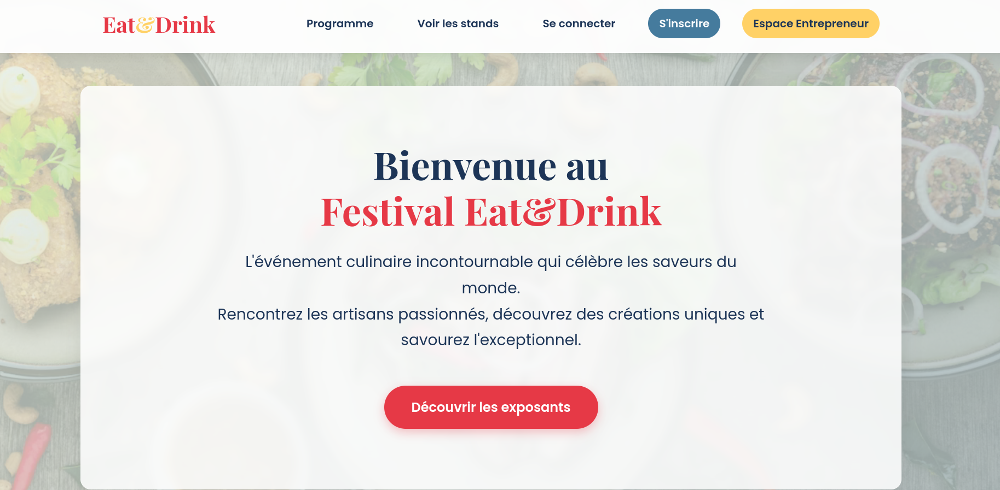
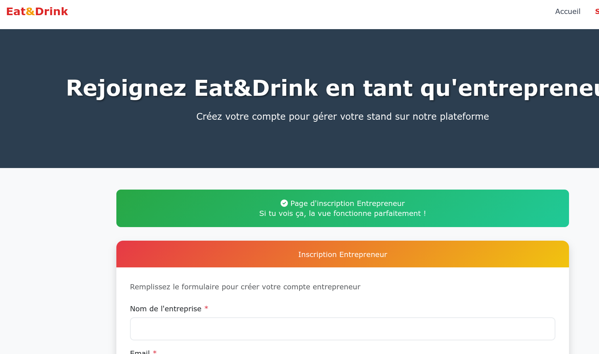
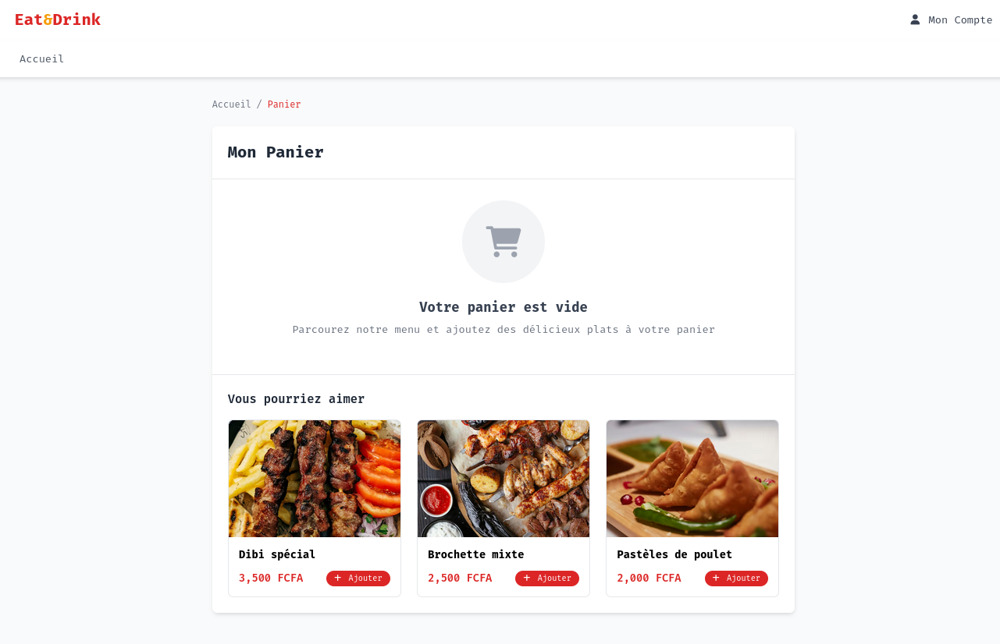

# Eat&Drink - Plateforme de Gestion de Stands Culinaires


**Eat&Drink** est une application web complète développée avec **Laravel**, conçue pour gérer et promouvoir les stands culinaires lors d'événements festifs au Bénin. Elle met en relation les visiteurs, les entrepreneurs (exposants) et les administrateurs pour une expérience gastronomique fluide et organisée.

## 📖 Table des Matières

- [Eat\&Drink - Plateforme de Gestion de Stands Culinaires](#eatdrink---plateforme-de-gestion-de-stands-culinaires)
  - [📖 Table des Matières](#-table-des-matières)
  - [🍽️ Aperçu du Projet](#️-aperçu-du-projet)
  - [✨ Fonctionnalités Clés](#-fonctionnalités-clés)
    - [👤 Pour les Visiteurs](#-pour-les-visiteurs)
    - [🍳 Pour les Entrepreneurs (Exposants)](#-pour-les-entrepreneurs-exposants)
    - [🛡️ Pour les Administrateurs](#️-pour-les-administrateurs)
  - [🛠️ Technologies Utilisées](#️-technologies-utilisées)
  - [🚀 Installation](#-installation)
  - [🗄️ Structure de la Base de Données](#️-structure-de-la-base-de-données)
  - [📄 Licence](#-licence)

---

## 🍽️ Aperçu du Projet

Eat&Drink vise à digitaliser la gestion des stands de nourriture (maquis, dibiteries, restaurants) lors de festivals. La plateforme permet aux entrepreneurs de s'inscrire, d'attendre une validation administrative, puis de gérer leurs produits et commandes. Les visiteurs peuvent découvrir les stands, consulter le programme et passer des commandes.


*> Page d'accueil présentant le festival et les options de navigation.*

---

## ✨ Fonctionnalités Clés

### 👤 Pour les Visiteurs
- **Consultation des Stands :** Vue détaillée des stands approuvés avec localisation et spécialités.
- **Programme des Événements :** Calendrier des animations (DJ, concerts, dégustations).
- **Compte Utilisateur :** Inscription, connexion et gestion du profil.
- **Panier :** Simulation de commande (section panier).

### 🍳 Pour les Entrepreneurs (Exposants)
- **Inscription & Validation :** Soumission de dossier avec statut (En attente, Approuvé, Refusé).
- **Tableau de Bord :** Vue d'ensemble des performances.
- **Gestion des Produits :** Ajout, modification et suppression des plats/boissons.
- **Suivi des Commandes :** Historique et statistiques des ventes.
- **Notifications :** Recevoir des emails lors de l'approbation ou du rejet du compte.


*> Formulaire d'inscription dédié aux entrepreneurs souhaitant exposer.*

### 🛡️ Pour les Administrateurs
- **Gestion des Utilisateurs :** Validation des comptes entrepreneurs (Approuver/Rejeter avec motif).
- **Suivi des Stands :** Liste complète des stands approuvés.
- **Statistiques Globales :** Nombre de demandes en attente, stands approuvés, commandes par stand.
- **Supervision des Commandes :** Accès détaillé aux commandes par stand.


*> Interface du panier permettant aux visiteurs de gérer leurs sélections.*

---

## 🛠️ Technologies Utilisées

- **Backend :** Laravel 12, PHP 8.2
- **Base de Données :** MySQL
- **Frontend :** Blade Templates, Tailwind CSS, Bootstrap 5
- **JavaScript :** jQuery, Owl Carousel, MixItUp, Chart.js (pour les statistiques)
- **Authentification :** Laravel Custom Guards (User, Entrepreneur, Admin)
- **Emailing :** Laravel Mails (Queueable)

---

## 🚀 Installation

Suivez ces étapes pour installer le projet localement :

1.  **Cloner le dépôt :**
    ```bash
    git clone https://github.com/votre-utilisateur/eat-and-drink.git
    cd eat-and-drink
    ```

2.  **Installer les dépendances :**
    ```bash
    composer install
    npm install
    ```

3.  **Configurer l'environnement :**
    Copiez le fichier `.env.example` vers `.env` et générez la clé :
    ```bash
    cp .env.example .env
    php artisan key:generate
    ```
    *Configurez vos identifiants de base de données dans le fichier `.env`.*

4.  **Migrer la base de données et Seeder :**
    ```bash
    php artisan migrate --seed
    ```
    *Cela créera les tables et ajoutera des données de test (Admin, Entrepreneurs, Stands).*

5.  **Lancer le serveur :**
    ```bash
    php artisan serve
    npm run dev
    ```

6.  **Accès par défaut (Seeders) :**
    - **Admin :** `admin@admin.com` / `password`
    - **Entrepreneur :** `que-du-kiff-event@gmail.com` / `password`

---

## 🗄️ Structure de la Base de Données

Les principales tables incluent :
- `users` : Visiteurs et Administrateurs.
- `entrepreneurs` : Gestion des exposants avec statut de validation.
- `stands` : Informations sur les stands (localisation, type, image).
- `produits` : Articles vendus par les stands.
- `commandes` : Historique des commandes (détails stockés en JSON).

---

## 📄 Licence

Ce projet est open-sourced sous la licence [MIT](https://opensource.org/licenses/MIT).

---

**Développé avec ❤️ pour la gastronomie béninoise.**